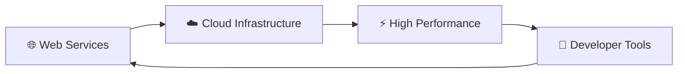
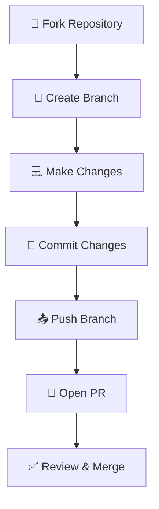

# 🚀 inkblade.cloud

<div align="center">

```
██╗███╗   ██╗██╗  ██╗██████╗ ██╗      █████╗ ██████╗ ███████╗
██║████╗  ██║██║ ██╔╝██╔══██╗██║     ██╔══██╗██╔══██╗██╔════╝
██║██╔██╗ ██║█████╔╝ ██████╔╝██║     ███████║██║  ██║█████╗  
██║██║╚██╗██║██╔═██╗ ██╔══██╗██║     ██╔══██║██║  ██║██╔══╝  
██║██║ ╚████║██║  ██╗██████╔╝███████╗██║  ██║██████╔╝███████╗
╚═╝╚═╝  ╚═══╝╚═╝  ╚═╝╚═════╝ ╚══════╝╚═╝  ╚═╝╚═════╝ ╚══════╝
```

[](https://inkblade.cloud)
[](https://github.com/1nkblade)
[](LICENSE)
[](https://github.com/1nkblade/inkblade.cloud/commits/main)
[](https://github.com/1nkblade/inkblade.cloud/stargazers)
[](https://github.com/1nkblade/inkblade.cloud/issues)

*Welcome to inkblade.cloud - a modern web platform built for the future* 🌟

</div>

## 📋 About

<div align="center">



</div>

inkblade.cloud is designed to provide cutting-edge web services and solutions. This repository contains the source code and documentation for the platform.

## ✨ Features

<table>
<tr>
<td width="50%">

### 🏗️ Architecture
- Modern web architecture
- Scalable infrastructure
- Cloud-native design
- High performance

</td>
<td width="50%">

### 🛠️ Technology Stack
- **Frontend**: Modern JavaScript/TypeScript
- **Backend**: Laravel PHP Framework
- **Database**: MySQL/PostgreSQL
- **Deployment**: Docker & Cloud

</td>
</tr>
</table>

## 🚀 Getting Started

### 📋 Prerequisites

Make sure you have the following installed on your system:

| Tool | Version | Purpose |
|------|---------|---------|
|  **Node.js** | v18+ | JavaScript runtime |
| 📦 **npm/yarn** | Latest | Package manager |
| 🐙 **Git** | Latest | Version control |

### ⚡ Quick Setup

<div align="center">

```bash
# 1️⃣ Clone the repository
git clone https://github.com/1nkblade/inkblade.cloud.git
cd inkblade.cloud

# 2️⃣ Install dependencies
npm install

# 3️⃣ Start development server
npm run dev
```

</div>

### 🎯 Installation Steps

1. **Clone the repository**:
   ```bash
   git clone https://github.com/1nkblade/inkblade.cloud.git
   cd inkblade.cloud
   ```

2. **Install dependencies**:
   ```bash
   npm install
   ```

3. **Start the development server**:
   ```bash
   npm run dev
   ```

4. **Open your browser** and visit `http://localhost:3000` 🌐

## 💻 Development

### 📁 Project Structure

```
inkblade.cloud/
├── 📂 src/                 # Source code
│   ├── 🎨 components/      # UI components
│   ├── 🔧 utils/           # Utility functions
│   └── 📄 pages/           # Page components
├── 📂 public/              # Static assets
│   ├── 🖼️ images/          # Image files
│   └── 🎨 css/             # Stylesheets
├── 📂 resources/           # Laravel resources
│   └── 📂 views/           # Blade templates
├── 📂 docs/                # Documentation
├── 📂 tests/               # Test files
└── 📄 README.md            # This file
```

### 🛠️ Available Scripts

<div align="center">

| Command | Description | Icon |
|---------|-------------|------|
| `npm run dev` | 🚀 Start development server | ⚡ |
| `npm run build` | 🏗️ Build for production | 📦 |
| `npm run test` | 🧪 Run tests | 🔬 |
| `npm run lint` | 🔍 Run linter | ✨ |

</div>

## 🤝 Contributing

We welcome contributions from the community! Here's how you can help:

<div align="center">



</div>

### 📋 Contribution Steps

1. **🍴 Fork the repository**
2. **🌿 Create a feature branch** (`git checkout -b feature/amazing-feature`)
3. **💻 Make your changes** and test them
4. **📝 Commit your changes** (`git commit -m 'Add some amazing feature'`)
5. **📤 Push to the branch** (`git push origin feature/amazing-feature`)
6. **🔄 Open a Pull Request**

### 📜 License

This project is licensed under the **MIT License** - see the [LICENSE](LICENSE) file for details.

[](https://opensource.org/licenses/MIT)

## 📞 Contact

<div align="center">

| Platform | Link | Description |
|----------|------|-------------|
| 🐙 **GitHub** | [@1nkblade](https://github.com/1nkblade) | Code repositories |
| 🌐 **Website** | [inkblade.cloud](https://inkblade.cloud) | Official website |
| 📧 **Email** | Contact via GitHub | General inquiries |

</div>

## 🙏 Acknowledgments

<div align="center">

✨ **Special thanks to:**

- 🧑‍💻 All contributors who help make this project better
- 🛠️ Built with modern web technologies
- 🌍 Inspired by the open source community
- 🚀 Powered by innovation and collaboration

</div>

---

<div align="center">

**⭐ If you found this project helpful, please give it a star!**

```
Made with ❤️ by 1nkblade
```

</div>