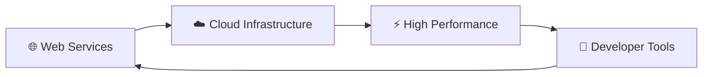
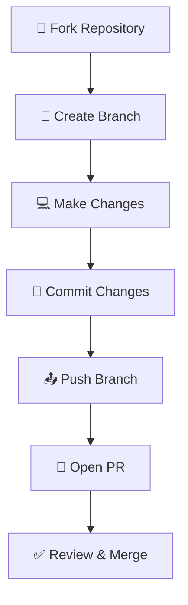

# 🚀 inkblade.cloud

<div align="center">

```
██╗███╗   ██╗██╗  ██╗██████╗ ██╗      █████╗ ██████╗ ███████╗
██║████╗  ██║██║ ██╔╝██╔══██╗██║     ██╔══██╗██╔══██╗██╔════╝
██║██╔██╗ ██║█████╔╝ ██████╔╝██║     ███████║██║  ██║█████╗  
██║██║╚██╗██║██╔═██╗ ██╔══██╗██║     ██╔══██║██║  ██║██╔══╝  
██║██║ ╚████║██║  ██╗██████╔╝███████╗██║  ██║██████╔╝███████╗
╚═╝╚═╝  ╚═══╝╚═╝  ╚═╝╚═════╝ ╚══════╝╚═╝  ╚═╝╚═════╝ ╚══════╝
```

[](https://inkblade.cloud)
[](https://github.com/1nkblade)
[](LICENSE)
[](https://github.com/1nkblade/inkblade.cloud/commits/main)
[](https://github.com/1nkblade/inkblade.cloud/stargazers)
[](https://github.com/1nkblade/inkblade.cloud/issues)

*Welcome to inkblade.cloud - a modern web platform built for the future* 🌟

</div>

## 📋 About

<div align="center">



</div>

inkblade.cloud is designed to provide cutting-edge web services and solutions. This repository contains the source code and documentation for the platform.

## ✨ Features

<table>
<tr>
<td width="50%">

### 🏗️ Architecture
- **Laravel 11.x** PHP Framework
- **MVC Architecture** with clean separation
- **Responsive Design** with Solarized Dark theme
- **Admin Panel** with authentication system

</td>
<td width="50%">

### 🛠️ Technology Stack
- **Backend**: Laravel 11.x
- **Frontend**: Blade templates, CSS3, JavaScript
- **Database**: MySQL with Eloquent ORM
- **Styling**: Custom CSS with JetBrains Mono font

</td>
</tr>
</table>

### 🎯 Key Features

- ✅ **Portfolio Website** with interactive sections
- ✅ **Project Management** system with database
- ✅ **RSS Feed** integration and management
- ✅ **Admin Authentication** with secure login
- ✅ **Responsive Design** for all devices
- ✅ **Modern UI/UX** with smooth animations

## 🚀 Getting Started

### 📋 Prerequisites

Make sure you have the following installed on your system:

| Tool | Version | Purpose |
|------|---------|---------|
| 🐘 **PHP** | v8.2+ | PHP runtime |
| 📦 **Composer** | Latest | PHP package manager |
| 🗄️ **MySQL** | v8.0+ | Database server |
| 🐙 **Git** | Latest | Version control |

### ⚡ Quick Setup

<div align="center">

```bash
# 1️⃣ Clone the repository
git clone https://github.com/1nkblade/inkblade.cloud.git
cd inkblade.cloud

# 2️⃣ Install dependencies
composer install

# 3️⃣ Setup environment
cp .env.example .env
php artisan key:generate

# 4️⃣ Setup database
php artisan migrate
php artisan db:seed --class=AdminUserSeeder

# 5️⃣ Start development server
php artisan serve
```

</div>

### 🎯 Installation Steps

1. **Clone the repository**:
   ```bash
   git clone https://github.com/1nkblade/inkblade.cloud.git
   cd inkblade.cloud
   ```

2. **Install dependencies**:
   ```bash
   npm install
   ```

3. **Start the development server**:
   ```bash
   npm run dev
   ```

4. **Open your browser** and visit `http://localhost:8000` 🌐

## 🔐 Admin Panel

The website includes a secure admin panel for content management:

### 🚪 Access Admin Panel

- **URL**: `https://inkblade.cloud/admin`
- **Username**: `inkblade`
- **Password**: `Shinseka1`

### 🛡️ Admin Features

- ✅ **Secure Authentication** with middleware protection
- ✅ **Dashboard** with site statistics and quick actions
- ✅ **User Management** (single admin user)
- ✅ **Session Management** with secure logout
- ✅ **CSRF Protection** for all forms

### 🔧 Admin Routes

| Route | Method | Description |
|-------|--------|-------------|
| `/admin` | GET | Login page |
| `/admin/login` | POST | Authentication |
| `/admin/dashboard` | GET | Admin dashboard (protected) |
| `/admin/logout` | POST | Logout |

## 💻 Development

### 📁 Project Structure

```
inkblade.cloud/
├── 📂 app/                 # Application code
│   ├── 🎮 Http/Controllers/ # Controllers
│   ├── 🛡️ Http/Middleware/  # Middleware
│   └── 📊 Models/          # Eloquent models
├── 📂 database/            # Database files
│   ├── 🗃️ migrations/      # Database migrations
│   └── 🌱 seeders/         # Database seeders
├── 📂 resources/           # Resources
│   └── 📂 views/           # Blade templates
│       ├── 🏠 home.blade.php
│       ├── 📁 admin/       # Admin views
│       └── 📁 layouts/     # Layout templates
├── 📂 routes/              # Route definitions
├── 📂 public/              # Public assets
│   ├── 🖼️ icons/           # Icon files
│   └── 🎨 css/             # Stylesheets
└── 📄 README.md            # This file
```

### 🛠️ Available Commands

<div align="center">

| Command | Description | Icon |
|---------|-------------|------|
| `php artisan serve` | 🚀 Start development server | ⚡ |
| `php artisan migrate` | 🗃️ Run database migrations | 📦 |
| `php artisan db:seed` | 🌱 Seed database | 🌱 |
| `php artisan route:list` | 📋 List all routes | 📋 |
| `php artisan cache:clear` | 🧹 Clear application cache | ✨ |

</div>

## 🤝 Contributing

We welcome contributions from the community! Here's how you can help:

<div align="center">



</div>

### 📋 Contribution Steps

1. **🍴 Fork the repository**
2. **🌿 Create a feature branch** (`git checkout -b feature/amazing-feature`)
3. **💻 Make your changes** and test them
4. **📝 Commit your changes** (`git commit -m 'Add some amazing feature'`)
5. **📤 Push to the branch** (`git push origin feature/amazing-feature`)
6. **🔄 Open a Pull Request**

### 📜 License

This project is licensed under the **MIT License** - see the [LICENSE](LICENSE) file for details.

[](https://opensource.org/licenses/MIT)

## 📞 Contact

<div align="center">

| Platform | Link | Description |
|----------|------|-------------|
| 🐙 **GitHub** | [@1nkblade](https://github.com/1nkblade) | Code repositories |
| 🌐 **Website** | [inkblade.cloud](https://inkblade.cloud) | Official website |
| 📧 **Email** | Contact via GitHub | General inquiries |

</div>

## 🙏 Acknowledgments

<div align="center">

✨ **Special thanks to:**

- 🧑‍💻 All contributors who help make this project better
- 🛠️ Built with modern web technologies
- 🌍 Inspired by the open source community
- 🚀 Powered by innovation and collaboration

</div>

---

<div align="center">

**⭐ If you found this project helpful, please give it a star!**

```
Made with ❤️ by 1nkblade
```

</div>